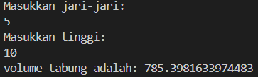

- Program menyiapkan sebuah fungsi bernama hitungVolTabung yang menerima dua parameter bertipe double yaitu jari dan tinggi
- Didalam fungsi dihitung volume = Math.PI * jari * jari * tinggi
- Fungsi hitungVolTabung mengembalikan nilai volume
- Program meminta untuk memasukkan sebuah bilangan dan disimpan di variabel jari-jari
- Program meminta untuk memasukkan sebuah bilangan dan disimpan di variabel tinggi
- Program menghitung volume dengan bantuan fungsi hitungVolTabung dengan menyertakan parameter jari dan tinggi
- Program mencetak hasil volume